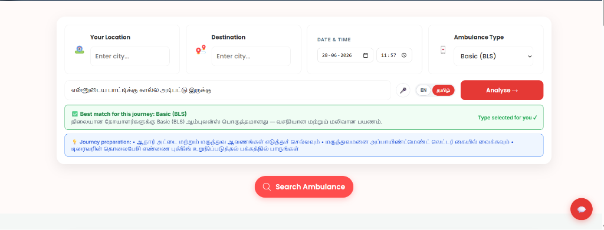
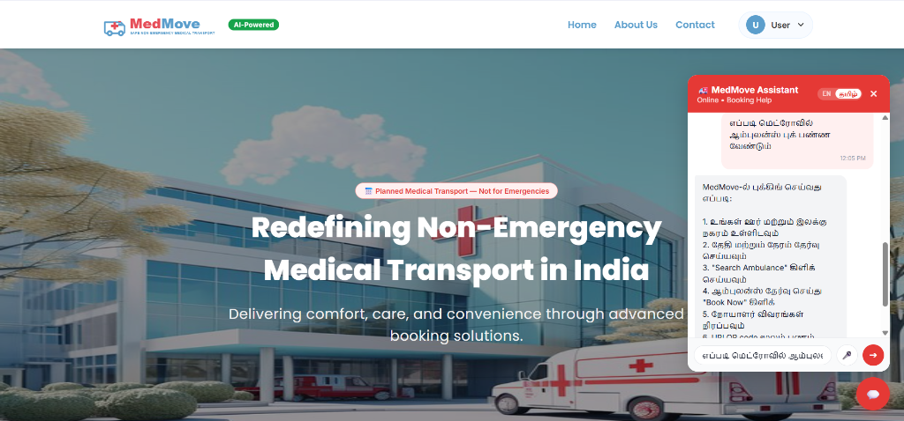
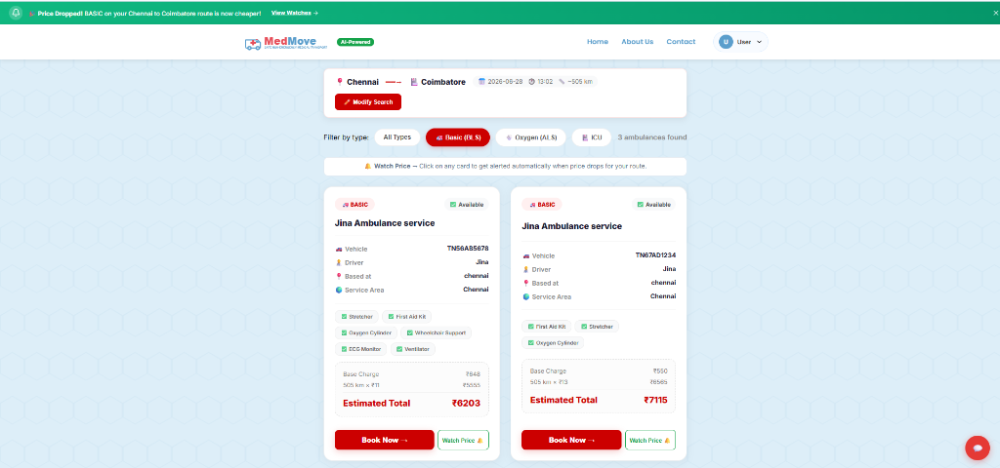
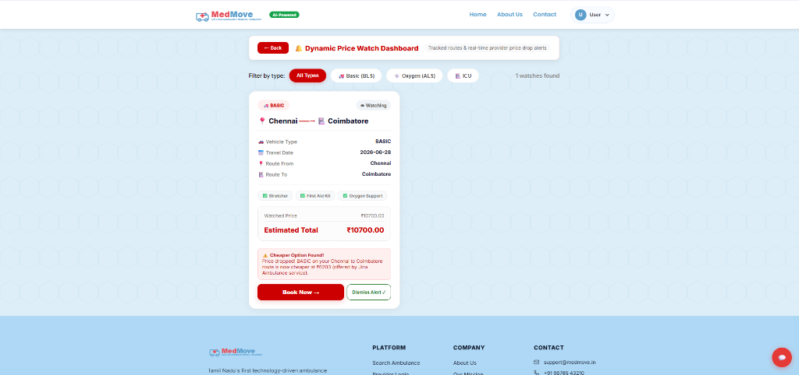
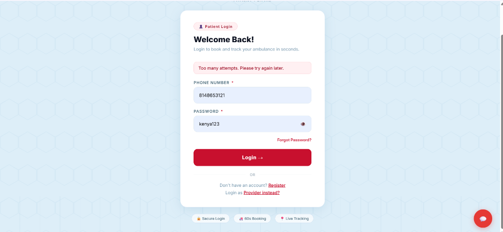
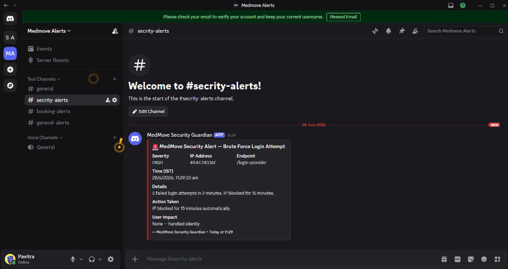

# 🚑 MedMove AI — Planned Medical Transport Platform for Tamil Nadu

> *"Like RedBus, but for ambulances — built for Tamil Nadu families who book dialysis transport 3 times a week."*

**Track:** Agents for Good | Kaggle AI Agents Intensive Vibe Coding Capstone 2026

**🔗 Live Links:**
- **Frontend (Vercel):** [https://med-move-ai-agent-integration-8liisifjv.vercel.app](https://med-move-ai-agent-integration-8liisifjv.vercel.app)
- **Backend API (Render):** [https://medmove-ai-agent-integration.onrender.com](https://medmove-ai-agent-integration.onrender.com)
- **Backend Health Check:** [https://medmove-ai-agent-integration.onrender.com/health](https://medmove-ai-agent-integration.onrender.com/health)
- **GitHub Repository:** [https://github.com/pavi116tra/MedMove_AI_agent_Integration.git](https://github.com/pavi116tra/MedMove_AI_agent_Integration.git)

---

## 🔴 The Problem

In Tamil Nadu, when a family needs to book a planned hospital transport — weekly dialysis, post-surgery discharge, elderly checkups — they face a nightmare:

- No centralized platform for scheduled ambulance booking
- Calling 10 providers one by one with no price comparison
- Drivers quote random amounts — zero transparency
- Tamil-speaking families have no language support
- Ambulance providers have no digital system to manage fleets
- No protection against price spikes on frequent journeys
- Security threats: brute force, OTP abuse, data scraping

> **Note:** MedMove is **NOT** a 108/102 emergency service. It is a planned transport booking platform — solving a gap that emergency services don't cover.

---

## ✅ The Solution

MedMove connects patients with ambulance providers for comfortable, scheduled medical transport across Tamil Nadu — with **3 AI agents working together autonomously**.

A Tamil-speaking grandmother can open MedMove, speak her needs in Tamil using voice input, get an AI recommendation for the right ambulance type, compare prices transparently, pay via UPI, and receive a WhatsApp PDF receipt — all without speaking a word of English.

---

## 🤖 AI Agents Architecture — 6 Agents Working Together

```
Patient (Browser)
      │
      ├──► 🤖 Agent 1: AI Triage & Transport Advisor
      │         ├── Voice Input (Tamil/English Speech-to-Text)
      │         ├── Google Gemini AI analyses patient condition
      │         ├── Recommends: Basic / Oxygen / ICU ambulance
      │         └── Detects emergencies → redirects to 108
      │
      ├──► 🔔 Agent 2: Dynamic Pricing Watch Agent
      │         ├── Patient clicks "Watch Price 🔔" on any result
      │         ├── setInterval runs every 60 minutes on server
      │         ├── Compares watched routes vs live provider prices
      │         └── Triggers NotificationBanner on cheaper find
      │
      ├──► 🛡️ Agent 3: Security Guardian Agent (Silent Background)
      │         ├── Runs on EVERY API request (middleware layer)
      │         ├── Brute Force Detector → blocks after 5 attempts
      │         ├── OTP Abuse Detector → rate limits per phone
      │         ├── SQLi/XSS Injection Detector → blocks patterns
      │         ├── Scraping Detector → bot fingerprinting
      │         ├── Discord Webhook → instant owner alert
      │         ├── MCP Server → 5 security tools over stdio
      │         └── CLI → node security-cli.js all
      │
      ├──► 🔁 Agent 4: Recurring Trip Agent
      │         ├── Patient opts in during booking modal confirmation
      │         ├── Daily cron job (6 AM) checks tomorrow's scheduled trips
      │         ├── Suggests recurring bookings in suggestion table
      │         └── Shows blue banner alert with one-click pre-filled booking
      │
      ├──► 📍 Agent 5: ETA & Route Agent (No-cost OSRM/Nominatim)
      │         ├── Geocodes city names to coordinates using Nominatim API
      │         ├── Computes driving distances/times via OSRM routing engine
      │         ├── Caches lookups inside local SQL table and in-memory caches
      │         └── Replaces static distances with dynamic ETA estimates on cards
      │
      └──► 🔔 Agent 6: WhatsApp Deep-Link Reminder Agent
                ├── Runs every 15 minutes checking bookings 2 hours away
                ├── Builds pre-filled wa.me text link for driver messaging
                ├── Saves reminder notification to general alerts
                └── Shows orange banner prompting WhatsApp deep-link trigger
```

### Agent 1 — AI Triage & Transport Advisor

Patients or families describe the journey in Tamil or English (typed or spoken via Web Speech API). Google Gemini AI analyses the description and recommends the right vehicle:

| Vehicle Type | Best For | Example |
| :--- | :--- | :--- |
| **Basic (BLS)** | Stable patients | Dialysis 3x/week, elderly checkups |
| **Oxygen (ALS)** | Breathing difficulty | COPD, home oxygen users |
| **ICU (Mobile ICU)** | Continuous monitoring | Hospital-to-hospital transfers |

The agent also detects emergency keywords (accident, heart attack) and redirects to 108 — MedMove never pretends to be an emergency service.

*Tamil Unicode Detection:* `const isTamil = /[\u0B80-\u0BFF]/.test(description)` — processes Tamil text natively without translation.

#### 🗣️ Real-Time Tamil Language AI Assistant — Live Evidence

When a user speaks or types in Tamil, MedMove automatically understands the input and responds entirely in Tamil across both the AI Triage Advisor and the Booking Assistant Chatbot.

**1. AI Triage Advisor ("Analyse" Box):**
- **User input in Tamil:** *"என்னுடைய பாட்டிக்கு கால்ல அடிபட்டு இருக்கு"* (My grandmother hurt her leg)
- **AI Response:** Recommends a **Basic (BLS) Ambulance** and explains in clear Tamil:
  - *Reason:* *"நிலையான நோயாளர்களுக்கு Basic (BLS) ஆம்புலன்ஸ் பொருத்தமானது — வசதியான மற்றும் மலிவான பயணம்."*
  - *Preparation Tips:* *"ஆதார் அட்டை மற்றும் மருத்துவ ஆவணங்கள் எடுத்துச் செல்லவும்..."*



**2. MedMove Booking Assistant (Chatbot):**
- **User input in Tamil:** *"எப்படி மெட்ரோவில் ஆம்புலன்ஸ் புக் பண்ண வேண்டும்"* (How to book an ambulance)
- **AI Response:** Automatically replies step-by-step in Tamil explaining the 7-step booking process cleanly.



### Agent 2 — Dynamic Pricing Watch Agent

- Patient clicks "Watch Price 🔔" on any search result card
- Record saved to `price_watches` table (route, date, vehicle type, current price)
- `runPricingAgent()` runs via `setInterval` every 60 minutes on the server
- Compares watched routes against live `executeAmbulanceSearch()` results
- If cheaper provider found → sets `alert_message` and `alert_seen = false`
- Frontend `PriceDropAlert.jsx` banner appears automatically

#### 🔔 Dynamic Pricing Watch Agent — Live Evidence

The Pricing Watch Agent runs autonomously on the server every hour to monitor ambulance rates across Tamil Nadu routes. When a provider lowers their fare, the agent instantly alerts patients so frequent travelers (like dialysis patients) save money.

**1. Live Price Drop Alert Banner (Search Results Page):**
- When a user visits any page, a prominent green alert banner appears at the top:
  - *"🔔 Price Dropped! BASIC on your Chennai to Coimbatore route is now cheaper! View Watches ➔"*



**2. Dynamic Price Watch Dashboard:**
- On the patient's Price Watch Dashboard, the tracked route card (`Chennai ➔ Coimbatore`) displays a real-time notification badge:
  - *"⚠️ Cheaper Option Found! Price dropped! BASIC on your Chennai to Coimbatore route is now cheaper at ₹6,203 (offered by Jina Ambulance service)."*



### Agent 3 — Security Guardian Agent

Silent background agent protecting every API call:

- **Brute Force:** IP blocked after 5 failed login attempts
- **OTP Abuse:** Rate limited per phone number
- **Injection:** SQLi and XSS patterns blocked in all inputs
- **Scraping:** Bot fingerprinting on rapid sequential requests
- **Discord Alerts:** Real-time webhook notification to owner on attack
- **MCP Server:** `mcp-server.js` exposes 5 security tools over stdio JSON-RPC
- **CLI:** `node security-cli.js all` for real-time security dashboard

### Agent 4 — Recurring Trip Agent

Explicit opt-in recurring trip assistant that provides reliable repeats for patients undergoing frequent procedures (like dialysis 3x/week):

- **Opt-in Form:** During booking confirmation, patient checks "Make this a recurring trip?" and picks repeating days (Mon/Wed/Fri etc.) plus an end date.
- **Background Cron:** `runRecurringAgent()` runs daily (at 6 AM) and checks active repeating bookings. If tomorrow is one of the scheduled days, it inserts a recommendation into the `RecurringSuggestion` table.
- **One-Click Rebook Banner:** A prominent blue alert banner prompts the user: *"🔁 It's almost time for your Tuesday dialysis trip — Book the same ambulance again?"*. Clicking "Book Again" pre-fills the search form on the homepage and executes the query instantly.

### Agent 5 — ETA & Route Agent

Free routing agent that replaces static calculations with real road routes and durations using OSM APIs:

- **Nominatim Geocoding:** Geocodes city inputs to coordinates. Caches results in the local `CityCoordinate` table to minimize API hits.
- **OSRM Driving Engine:** Queries `router.project-osrm.org` to fetch actual driving distance and travel duration.
- **In-Memory Cache:** Keyed by route to prevent repeated calculations during the same day.
- **Robust Fallback:** If OSRM limits traffic, catches exceptions and falls back to straight-line distance mapping and 40km/h traffic duration estimators.
- **Search Card Updates:** Displays dynamic distance and ETA (e.g. `📍 505 km · ⏱ ETA 7h 40m`) on the frontend search result cards.

### Agent 6 — Reminder Agent

Zero-cost, SMS-free notification agent that alerts patients of upcoming travels:

- **Background Daemon:** `runReminderAgent()` runs on a 15-minute interval checking confirmed bookings.
- **Window Filter:** Targets bookings scheduled between 1h 45m and 2h 15m from the current server time.
- **WhatsApp Link Generation:** Builds a pre-filled WhatsApp link (`wa.me/<driver_phone>`) targeting the driver's phone with trip details.
- **Orange Alert Banner:** Prompts an urgent alert banner on the dashboard: *"🔔 Your ambulance to Coimbatore arrives in 2 hours — Message driver on WhatsApp →"*. Clicking it opens the pre-filled WhatsApp link in a new browser tab and dismisses the alert.

---

## 📋 Course Concepts Demonstrated

| Concept | Where | Details |
| :--- | :--- | :--- |
| **Multi-agent system** | Code | 3 autonomous agents: Triage, Pricing Watch, Security Guardian |
| **MCP Server** | Code | `backend/mcp-server.js` — 5 security tools over stdio JSON-RPC |
| **Antigravity** | Video | Entire project built using AI-assisted vibe coding |
| **Security features** | Code + Video | `securityGuard.js` — brute force, OTP abuse, SQLi/XSS, Discord alerts |
| **Deployability** | Video | Live on Vercel + Render + Aiven MySQL |
| **Agent CLI** | Code + Video | `node security-cli.js all` — real-time security inspection |

---

## 🌐 Live Demo

| Service | URL |
| :--- | :--- |
| **Frontend (Vercel)** | https://med-move-ai-agent-integration-8liisifjv.vercel.app |
| **Backend API (Render)** | https://medmove-ai-agent-integration.onrender.com |
| **Health Check** | https://medmove-ai-agent-integration.onrender.com/health |

**Demo credentials:**
- **Patient:** demo@medmove.in / Demo@1234
- **Provider:** provider@medmove.in / Demo@1234

> *Note: Backend is on Render free tier. First load after inactivity takes ~30 seconds (cold start). Open the health check URL first to wake it up.*

---

## 🎥 Video Demo

Watch the 5-minute demo on YouTube: [Link]

Covers:
- Tamil voice input → AI ambulance recommendation
- Price watch alert triggering
- UPI payment → animated confirmation → WhatsApp PDF receipt
- Fail login 5 times → Discord security alert on phone
- `node security-cli.js all` terminal dashboard
- Antigravity building the project (vibe coding)
- Live deployed URL walkthrough

---

## ✨ What Makes MedMove Unique

### 1. Real Tamil Language Support — not just translation
Unicode-based Tamil detector processes Tamil natively. The chatbot and triage agent respond in Tamil when asked in Tamil. Tamil families can use MedMove without knowing English.

### 2. Voice Input in Tamil
Web Speech API works for Tamil speech-to-text. Elderly patients can speak their needs — no typing required.

### 3. 3 Agents coordinating autonomously
Triage Agent selects the vehicle. Pricing Watch Agent monitors costs hourly. Security Guardian protects every request. Each runs independently without human intervention.

### 4. Production-quality UX
UPI QR payment with click-to-copy, animated SVG checkmark confirmation, jsPDF receipt generation, WhatsApp PDF sharing — not a prototype, a real product.

### 5. Emergency Redirect Logic
AI detects emergency keywords and redirects to 108 instead of booking. MedMove is ethically clear about its scope.

### 6. Every other submission is a Jupyter notebook
MedMove is a full-stack web application a Tamil Nadu family could open on their phone right now and book an ambulance in Tamil using their voice.

---

## ⚙️ Setup & Installation

### Prerequisites
- Node.js 18+
- MySQL 8.0+ (local) or Aiven MySQL (production)
- Google Gemini API key (free at aistudio.google.com)
- Discord webhook URL (for security alerts)

### 1. Clone the repository
```bash
git clone https://github.com/pavi116tra/MedMove_AI_agent_Integration.git
cd MedMove_AI_agent_Integration
```

### 2. Configure backend environment
```bash
cd backend
cp .env.example .env
```

Edit `.env` with your values:
```env
DB_HOST=your_mysql_host
DB_PORT=3306
DB_USER=your_mysql_user
DB_PASSWORD=your_mysql_password
DB_NAME=medmove_db
JWT_SECRET=your_jwt_secret
GEMINI_API_KEY=your_gemini_api_key
DISCORD_WEBHOOK_URL=your_discord_webhook
SECURITY_SECRET=your_security_secret
NODE_ENV=development
```

### 3. Start backend
```bash
cd backend
npm install
node server.js
# Runs on http://localhost:5000
# Sequelize auto-creates all 8 tables on first run
```

### 4. Start frontend
```bash
cd medmovereactapp
npm install
npm start
# Runs on http://localhost:3000
```

### 5. Run Security CLI (separate terminal)
```bash
cd backend
node security-cli.js all        # Full security dashboard
node security-cli.js status     # Threat summary
node security-cli.js threats    # Active threat log
```

### 6. Run MCP Server (separate terminal)
```bash
cd backend
npm run mcp
# MCP Server on stdio — connect via any MCP-compatible AI agent
```

---

## 📁 Project Structure

```
MedMove_AI_agent_Integration/
│
├── backend/
│   ├── server.js                    # Express API + Pricing Watch Agent (60min interval)
│   ├── mcp-server.js                # MCP Server — 5 security tools over stdio JSON-RPC
│   ├── security-cli.js              # Security CLI tool
│   ├── .env.example                 # Environment variable template
│   ├── middleware/
│   │   ├── auth.js                  # JWT middleware
│   │   └── securityGuard.js         # Security Guardian Agent (all 4 detectors)
│   ├── models/                      # 8 Sequelize ORM models
│   │   ├── user.js                  # Patients table
│   │   ├── provider.js              # Ambulance companies table
│   │   ├── ambulance.js             # Vehicle fleet table
│   │   ├── booking.js               # Booking records table
│   │   ├── otplog.js                # OTP verification table
│   │   ├── ambulanceSlot.js         # Slot blocking table
│   │   ├── providerEarning.js       # Provider earnings table
│   │   └── priceWatch.js            # Price watch tracking table
│   ├── controllers/
│   │   ├── aiTriageController.js    # Agent 1: Triage + Tamil ChatBot engine
│   │   ├── pricingWatchController.js # Agent 2: Pricing Watch + runPricingAgent()
│   │   ├── auth_controller.js       # Authentication & OTP
│   │   ├── ambulanceController.js   # Search + executeAmbulanceSearch helper
│   │   └── bookingController.js     # Booking + WhatsApp URL builder
│   └── routes/                      # REST API routes
│
└── medmovereactapp/src/
    ├── config/api.js                # API base URL (reads REACT_APP_API_URL)
    ├── context/AuthContext.jsx      # Authentication context
    ├── pages/
    │   ├── SearchResults.jsx        # Watch Price 🔔 + same-page filtering
    │   ├── PriceWatchDashboard.jsx  # Price watch cards dashboard
    │   ├── Payment.jsx              # UPI QR + animated SVG confirmation
    │   └── BookingSuccess.jsx       # jsPDF receipt + WhatsApp share
    └── Components/
        ├── ChatBot/                 # Bilingual Tamil/English chatbot
        └── PriceDropAlert/          # Price drop banner component
```

---

## 🛠️ Tech Stack

| Layer | Technology |
| :--- | :--- |
| **Frontend** | React.js, React Router, CSS Modules |
| **Backend** | Node.js, Express.js |
| **Database** | MySQL, Sequelize ORM (8 models) |
| **AI** | Google Gemini API (gemini-1.5-flash) |
| **Voice** | Web Speech API (browser-native, Tamil + English) |
| **PDF** | jsPDF |
| **Security** | JWT, bcrypt, custom middleware agents |
| **Alerts** | Discord Webhooks |
| **MCP** | JSON-RPC over stdio |
| **Deployment** | Vercel (frontend) + Render (backend) + Aiven MySQL |

---

## 🚀 Deployment Architecture

```
User (Browser)
      │
      ▼
Vercel (Frontend — React.js)
https://med-move-ai-agent-integration-8liisifjv.vercel.app
      │
      │  REACT_APP_API_URL
      ▼
Render (Backend — Node.js/Express)
https://medmove-ai-agent-integration.onrender.com
      │
      │  SSL MySQL connection
      ▼
Aiven MySQL (Cloud Database)
All 8 tables — providers, ambulances, bookings, users...
      
Security Guardian Agent runs on every request ↑↑↑
Pricing Watch Agent runs setInterval every 60min ↑↑↑
Discord Webhook fires on attack detection → Owner phone
```

---

## 🔒 Security Features

All implemented in `backend/middleware/securityGuard.js`:

```javascript
// Brute Force Detection
if (failedAttempts >= 5) blockIP(req.ip);

// OTP Abuse Detection  
if (otpRequests >= 3 in 10min) rateLimitPhone(phone);

// SQL Injection Detection
const sqlPattern = /(\bSELECT\b|\bDROP\b|\bINSERT\b|--|;)/i;

// XSS Detection
const xssPattern = /<script|javascript:|on\w+=/i;

// Discord Alert on Detection
await sendDiscordAlert({ type, ip, timestamp, details });
```

---

## 🛡️ Security Guardian Agent — Live Evidence

The Security Guardian Agent was tested on the live deployed site.
Results confirmed working in production:

**Test performed:** 5 consecutive failed login attempts on https://med-move-ai-agent-integration-8liisifjv.vercel.app

**Result on website:**
"Too many attempts. Please try again later." — IP blocked instantly.



**Result on Discord (#secrity-alerts channel):**



---

## 👩‍💻 Built By

**Pavitra S** — Tamil Nadu, India

Built with Antigravity (AI-assisted vibe coding) for the Kaggle AI Agents Intensive Capstone 2026.

Submitted under track: **Agents for Good**

---

*MedMove exists because every Tamil family deserves to book a dialysis ambulance in their own language, at a fair price, in under 2 minutes.*

**வணக்கம் 🙏**
